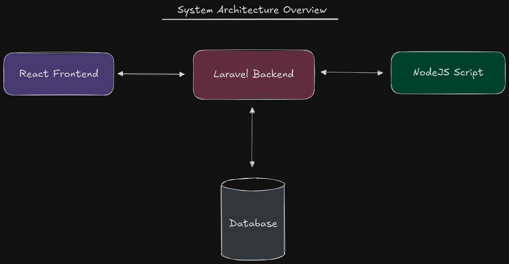
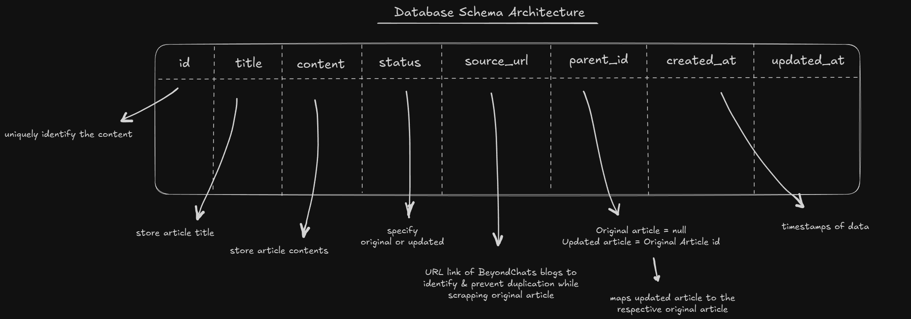
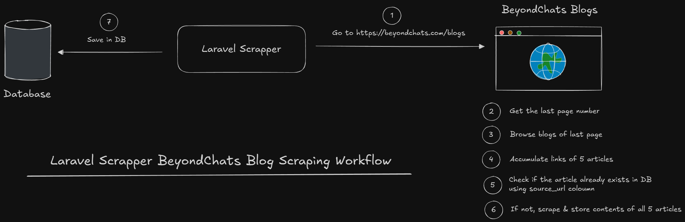
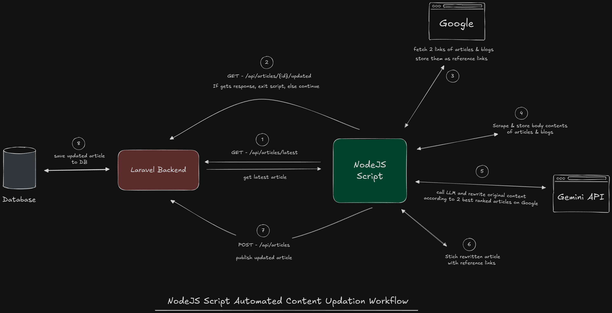
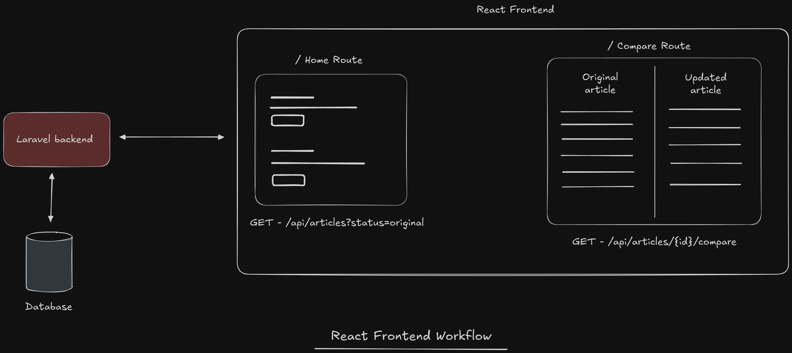

# BeyondChats Assignment - Summary & Local Setup Instructions

This repository contains a complete end-to-end description of the BeyondChats assignment, implemented in three phases:

1. **Laravel backend** with scraping and CRUD APIs
2. **Node.js automation script** for article enhancement using external references and an LLM
3. **React frontend** for viewing and comparing original and updated articles

The repository is structured as a monorepo for clarity and separation of concerns.

> **🚀 Live Link:** [https://beyondchats-frontend-peach.vercel.app/](https://beyondchats-frontend-peach.vercel.app/)

---

## Quick Start

### Clone the Repository

```bash
git clone https://github.com/heydeepakch/beyondchats-assignment.git
cd beyondchats-assignment
```

---

## Repository Structure

```
beyondchats-assignment/
├── laravel-backend/      # Laravel API + database + scraper
├── nodejs-script/        # Node.js automation script
├── react-frontend/       # React frontend application
└── README.md
```

---

## Prerequisites

Before you begin, ensure you have the following installed:

- **PHP** >= 8.2
- **Composer** (latest version)
- **Node.js** >= 18.x
- **npm** or **yarn**
- **MySQL** (via XAMPP, MAMP, or standalone)
- **Git**




---


# Phase 1: Laravel Backend

## Tech Stack

- Laravel 12
- PHP 8.2+
- MySQL (local development)
- PostgreSQL (production on Render)
- Guzzle HTTP Client
- Symfony DOM Crawler

## Local Backend Setup

### Step 1: Navigate to Backend Directory

```bash
cd laravel-backend
```

### Step 2: Install PHP Dependencies

```bash
composer install
```

### Step 3: Create Environment File

```bash
cp .env.example .env
```

You can either create a `.env` file with the following content (main content to be used):

```env
APP_NAME=BeyondChatsAssignment
APP_ENV=local
APP_KEY=
APP_DEBUG=true
APP_URL=http://localhost:8000

LOG_CHANNEL=stack
LOG_LEVEL=debug

DB_CONNECTION=mysql
DB_HOST=127.0.0.1
DB_PORT=3306
DB_DATABASE=beyondchats_assignment
DB_USERNAME=root
DB_PASSWORD=your_mysql_password

SCRAPER_SECRET=your-secret-key-here
```

**Important:** Update `DB_USERNAME` and `DB_PASSWORD` with your MySQL credentials.

### Step 4: Create MySQL Database

Make sure MySQL is running, then create the database:

```bash
# On Windows (using MySQL command line)
mysql -u root -p
```

```sql
CREATE DATABASE beyondchats_assignment;
EXIT;
```

**OR using a GUI tool like phpMyAdmin, MySQL Workbench, or TablePlus:**

- Create a new database named `beyondchats_assignment`

### Step 5: Generate Application Key

```bash
php artisan key:generate
```

### Step 6: Run Database Migrations

```bash
php artisan migrate
```

### Step 7: Start the Laravel Server

```bash
php artisan serve
```

Backend will be available at: **http://localhost:8000**



---

## Scraping the Oldest BeyondChats Articles

The backend includes a Laravel Artisan command that scrapes the 5 oldest articles from the BeyondChats blog.

### Command

```bash
php artisan scrape:oldest-blogs
```

This will:

- Detect the last page of the blog
- Fetch the 5 oldest articles
- Store them in the database as `original` articles
- Skip articles that already exist in the database


---

## API Endpoints Overview

### Articles

- `GET /api/articles` - Get all articles
- `GET /api/articles?status=original` - Get only original articles
- `GET /api/articles?status=updated` - Get only updated articles
- `GET /api/articles/latest` - Get the latest original article
- `GET /api/articles/{id}` - Get a specific article
- `GET /api/articles/{id}/compare` - Compare original and updated article
- `GET /api/articles/{id}/updated` - Get updated version of an article
- `POST /api/articles` - Create a new article
- `PUT /api/articles/{id}` - Update an article
- `DELETE /api/articles/{id}` - Delete an article

### Scraper

- `GET /api/run-scraper?key={SCRAPER_SECRET}` - Trigger scraper manually (temporarily added to run scrapper from browser),  but should be preffered to run via command

---

# Phase 2: Node.js Automation Script

## Purpose

The Node.js script automates the article enhancement process:

1. Fetches the latest **original** article from the Laravel API
2. Check if updated version exists or not
3. Searches Google for top-ranking related articles using **Serper API**
4. Scrapes reference articles using **Cheerio**
5. Uses **Google Gemini** to rewrite and improve the original article
6. Appends references in Markdown format
7. Publishes the updated article back to Laravel

## Tech Stack

- Node.js
- Axios
- Cheerio
- dotenv
- Google Gemini API
- Serper API

## Local Setup

### Step 1: Navigate to Script Directory

```bash
cd nodejs-script
```

### Step 2: Install Dependencies

```bash
npm install
```

### Step 3: Create Environment File

Create a `.env` file in the `nodejs-script` directory:

```env
LARAVEL_BASE_URL=http://localhost:8000/api
GEMINI_API_KEY=your-gemini-api-key-here
SERPER_API_KEY=your-serper-api-key-here
```

**Where to get API keys:**

- **GEMINI_API_KEY**: Get it from [Google AI Studio](https://aistudio.google.com/apikey)
- **SERPER_API_KEY**: Get it from [Serper.dev](https://serper.dev/)

### Step 4: Run the Automation Script

Make sure the Laravel backend is running first, then:

```bash
npm run start
```

### ⚠️ Important Notes

- **Always run from the `nodejs-script` directory** using `npm run start`
- Do NOT `cd` into `src/` and run `node index.js` directly (this causes path resolution issues for dotenv)
- The script is **idempotent**: If an updated article already exists, it will skip execution
- Safe to run multiple times

### What the Script Does

```
┌─────────────────────────────────────────────────────────┐
│  1. Fetch latest original article                      │
│  2. Check if updated version exists → Skip if yes      │
│  3. Search Google for similar blog posts               │
│  4. Scrape content from top 2 reference articles       │
│  5. Send to Gemini AI for rewriting                    │
│  6. Append clickable references                        │
│  7. Publish updated article to Laravel                 │
└─────────────────────────────────────────────────────────┘
```



---

# Phase 3: React Frontend

## Purpose

The frontend provides a user-friendly interface to:

- Display list of original articles
- Compare original and AI-updated versions side by side
- Render article content using Markdown

## Tech Stack

- React 19
- Vite
- React Router DOM
- react-markdown
- Tailwind CSS
- Axios

## Local Frontend Setup

### Step 1: Navigate to Frontend Directory

```bash
cd react-frontend
```

### Step 2: Install Dependencies

```bash
npm install
```

### Step 3: Create Environment File

Create a `.env` file in the `react-frontend` directory:

```env
VITE_API_BASE_URL=http://localhost:8000/api
```

### Step 4: Start Development Server

```bash
npm run dev
```

Frontend will be available at: **http://localhost:5173**

### Build for Production

```bash
npm run build
```

### Preview Production Build

```bash
npm run preview
```

---

## Application Pages

### Home Page (`/`)

- Lists all original articles
- Shows article titles
- Links to view articles in Comparison view

### Compare Page (`/compare/:id`)

- Split-screen (50:50) comparison layout
- Left side: Original article
- Right side: AI-updated article
- Markdown rendering with clickable references
- Responsive design



---

## Running the Complete Application

To run the full stack locally, you need **3 terminal windows**:

### Terminal 1: Start Backend

```bash
cd laravel-backend
php artisan serve
# Runs on http://localhost:8000
```

### Terminal 2: Start Frontend

```bash
cd react-frontend
npm run dev
# Runs on http://localhost:5173
```

### Terminal 3: Run Automation Script (when needed)

```bash
cd nodejs-script
npm run start
# Runs once and exits
```

---

## Key Design Decisions

### 1. Single Table with Versioning

- Uses a single `articles` table
- Versioning handled via `status` (`original` / `updated`) and `parent_id`
- Maintains data integrity with foreign key constraints

### 2. Idempotent Pipelines

- Scraping command checks for existing articles before inserting
- Automation script checks for existing updated versions
- Safe to run multiple times without duplicates

### 3. Markdown-Based Content

- Content stored and rendered as Markdown
- Clean, semantic markup
- Clickable references at the bottom of updated articles
- Easy to parse and display

### 4. Separation of Concerns

- Backend: Data persistence and API
- Automation: Business logic for enhancement
- Frontend: Presentation layer
- Each layer is independent and deployable separately

---

## Deployment Notes (Production)

### Backend

- Deployed on **Render** using Docker
- Uses **PostgreSQL** as production database
- Migrations run automatically on container startup
- Environment variables configured in Render dashboard

### Frontend

- Deployed on **Vercel**
- Automatic deployments from Git
- Environment variables set in Vercel project settings

### Automation Script

- Runs externally (cron job, scheduled task, or manual trigger)
- Communicates with production backend API
- API keys stored securely in environment

---

## Troubleshooting

### Backend Issues

#### Backend won't start

- Ensure PHP 8.2+ is installed: `php -v`
- Check if port 8000 is available
- Verify MySQL is running
- Check database credentials in `.env`

#### Database connection errors

- Verify MySQL service is running:
  - **Windows**: Check Services or run `net start mysql`
  - **Mac**: `brew services list` or `mysql.server status`
  - **Linux**: `sudo systemctl status mysql`
- Test MySQL connection: `mysql -u root -p`
- Ensure database `beyondchats_assignment` exists
- Check `DB_USERNAME` and `DB_PASSWORD` are correct

#### Migration fails

- Clear config cache: `php artisan config:clear`
- Check MySQL user has proper permissions:
  ```sql
  GRANT ALL PRIVILEGES ON beyondchats_assignment.* TO 'root'@'localhost';
  FLUSH PRIVILEGES;
  ```

#### MySQL 8.0+ authentication errors

```sql
ALTER USER 'root'@'localhost' IDENTIFIED WITH mysql_native_password BY 'your_password';
FLUSH PRIVILEGES;
```

### Node.js Script Issues

#### Script fails at fetching latest article

- Ensure backend is running first
- Check `.env` file has correct `LARAVEL_BASE_URL`
- Verify API endpoint: `curl http://localhost:8000/api/articles/latest`

#### API key errors

- Verify GEMINI_API_KEY is valid
- Verify SERPER_API_KEY is valid
- Check API rate limits haven't been exceeded

#### Path resolution errors

- Always run from `nodejs-script` directory
- Use `npm run start`, not `node src/index.js`

### Frontend Issues

#### Frontend can't connect to backend

- Verify backend is running on port 8000
- Check `VITE_API_BASE_URL` in `.env`
- Check browser console for CORS errors
- Restart Vite dev server after changing `.env`

#### CORS errors

- Laravel has CORS enabled by default for all origins
- In production, configure `config/cors.php` to restrict origins


## 📄 License

MIT License

---

## 👤 Author

Created as part of the BeyondChats assignment by Deepak Choudhary.


